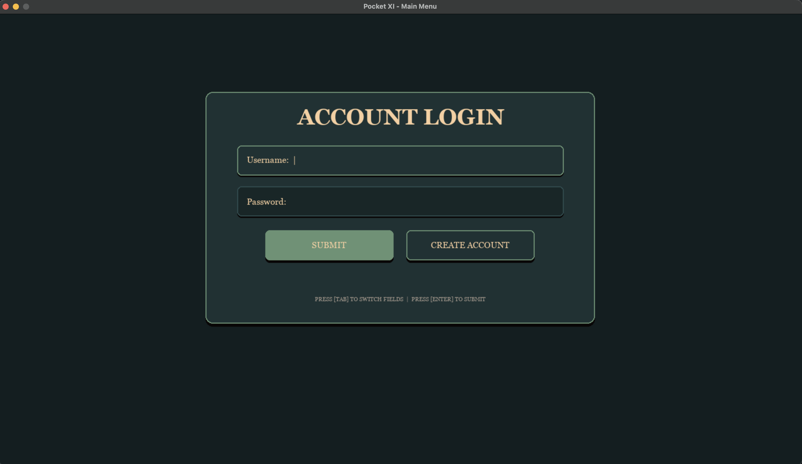
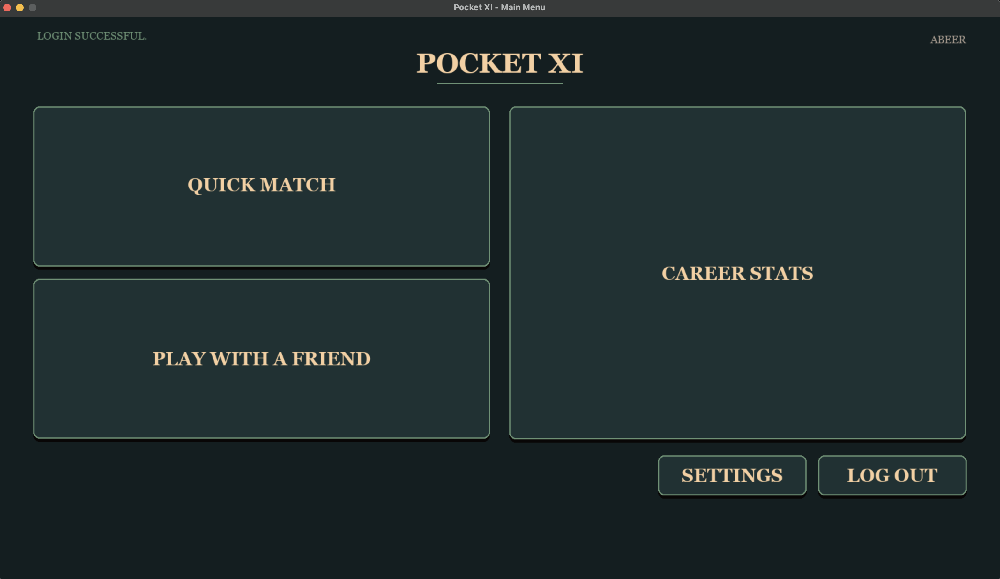
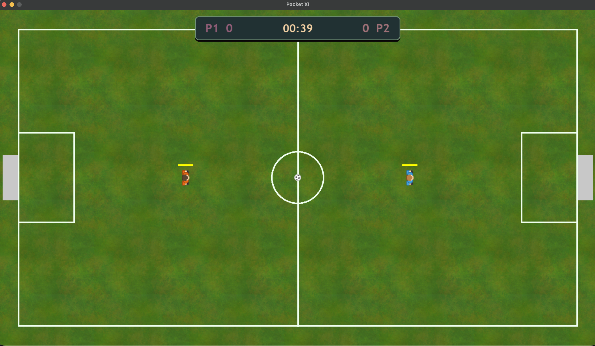

# Pocket XI

A two-player local football game built in Python with Pygame, featuring encrypted user profiles, adaptive AI, and enjoyable physics.

## Overview

Pocket XI is a top-down arcade football game where two players compete on a single screen. The game incorporates user account management with data being encrypted and stored locally, an AI system that adapts to player patterns, and a full physics engine for ball and player interactions.

## Screenshots

### Login Screen



### Main menu



### Gameplay & Match



## Features

- **Local Multiplayer** - Two players on one keyboard (WASD vs Arrow keys)
- Online Multiplayer - Two players on two different sessions/devices play against each other
- **Encrypted User Profiles** - Salted SHA-256 hashing and Fernet symmetric encryption for stored game data
- **Adaptive AI** - FSM-based AI with heatmap positioning, pattern analysis, and heuristic difficulty scaling
- **Physics Engine** - Ball friction, Magnus effect curve, collision detection, and momentum-based kicking
- **Power Shot System** - Charge-based mechanic with stamina cost and visual particle feedback
- **Stamina Management** - Sprint decay, recharge delay, and exhaustion mechanics
- **Animated Sprites** - Frame-based walking animations with stride and bob effects
- **Sound Design** - Procedural crowd chants, impact sounds, and ambient effects
- **Stats Tracking** - Goals, shots, and possession time saved per user profile

## Requirements

- Python 3.8+
- Pygame
- cryptography

## Installation

```bash
pip install pygame cryptography
```

## Usage

```bash
python PocketXI.py
```

## Hosting

```bash
pip install pygbag
python -m pygbag main.py
```

## Controls

| Action     | Player 1   | Player 2    |
| ---------- | ---------- | ----------- |
| Move       | W A S D    | Arrow Keys  |
| Sprint     | Left Shift | Right Shift |
| Power Shot | Space      | Enter       |
| Pause      | Escape / P | Escape / P  |

## AI Usage

AI was used mostly to add support for pygbag, along with some bug fixes and understanding of pygame itself.

## License

This project was designed for educational purposes. It only uses assets under MIT Open Source License or CC0 License
